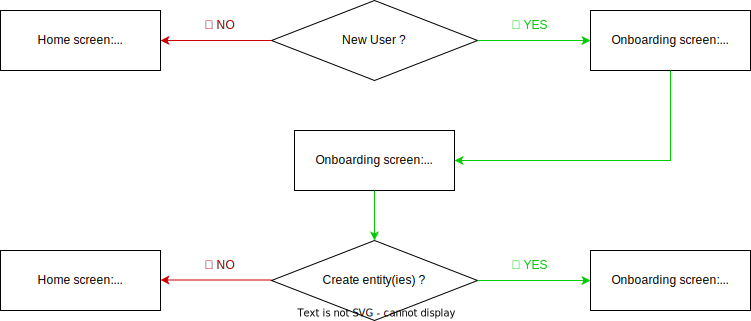

# Magma Onboarding

## Installation

To download the project.

```bash
git https://github.com/nrifki/magma-onboarding.git
cd magma-onboarding
```

To run the project.

```bash
npm install
npm run serve
```

You should be able to access the project at [http://localhost:8080](http://localhost:8080).

## Challenge & Inspiration:

### Challenge:

🎯 The aim of creating an onboarding process is to allow our users to get up and running with the platform:

- in a short amount of time,
- with full autonomy.

Because as we all know, the sooner he gets to experience the value of our product (preferably in an "aha" moment 😉) the more likely he will be encouraged to return and use our solution.

☝🏼 However, knowing our typical user profile, we have to take into consideration his lack of speed, tech language, motor skills and even concentration.

➡️ This is why our onboarding has to be sleek and simple in order to not overwhelm users (especially new users).

⚠️ The next step the user has to take must be simple to spot and understand, while providing him with a vision of his progress (so he knows how long the process will take and be incetivised to complete it instead of dropping it because god knows how long will it take).

And of course, let's think 📱 mobile first. Not just to have a responsive layout, but it also helps us know what is nice-to-have and what is must-have (especially when we need to stay minimalistic).

### User Experience (basic information)

Based on the brief I was provided I designed a flowchart that simplifies the first part of onboarding; the basic user information.



1 - 🔍 We first need to detect if we're dealing with a new user.

2 - If it's a user who already has his dashboard all set up, we will show him directly to the home screen where each entity's dashboard (if many) is listed and accessible (in a minimalistic view with one entity's dashboard = one clickable box with entity's logo and name).

2b - If in the other hand, we are dealing with a new user an onboarding modale should pop-up.

3 - First, he is required to provide the name, description and logo of his organization.

4 - Then he must list the first name, last name and email of his all the admins (regardless of the entity they will manage, if there are many).

5 - After that he is asked if he needs to create entities (so each of his organization's entities gets its own personnalized dashboard).

6a - If there are no entities in his organization, he is redirected to the home screen where he can access his dashboard and the default entity generated will have the name, description, logo and admins of the organization.

6b - If there are many entities in his organization, he can list them and is l-only required to provide its name and list its admins (the description and logo can otherwise default to the organisation's).

7 - He is then finally redirected to the home screen to access his dashboard.

> disclaimer: instead of the home screen I have integrated the payload so you can visualize its structure and the data collected (also because of the lack of time and having other priorities in this test 🤷🏻‍♀️).

### Inspirations:

I started by spending some time on Dribbble and (of course) with a simple google search about onboarding for non-technical users.

I've saved a few here in [this collection](https://dribbble.com/n475u/collections/5611591-Magma-Onboarding-Inspiration).

But [Typeform](https://www.typeform.com/templates/t/client-onboarding-form-template/) and [ClearBrain](https://dribbble.com/shots/17907651-ClearBrain-s-first-log-in) were my main sources of inspiration.

## The front-end tech stack:

### General:

- The project is using Vue 3, TypeScript, and TailwindCSS.

- To avoid reinventing the wheel, [FormKit](https://formkit.com/) is used to generate form elements. It comes with built-in validation and offers the essential components that can be needed. The default style theme is used to save time.

### Some details:

- Vue Meta is set up and used.

- i18n(internationalization plugin, a.k.a translation), Jest (unit testing) and Cypress (end-to-end testing) are configured but not used yet.

- Animations have been built using `vue2-animate`. Despite the name, this package is compatible with Vue 3. The confetti animation was integrated using `vue-confetti-explosion`.

### Code conventions:

- Common components are prefixed with `Base`.

- If you look at each component, I take great care in making sure everything is sorted (by category and alphabetically) and divided. In the long run, it is a huge time saver because we do not have to think about where to put things or _decoding_ code.

- If you are using VSCode, the Tailwind's utility classes are automatically sorted on saving thanks to the `prettier-plugin-tailwindcss` plugin.

- I did not touch the eslint configuration and directly used the one with Vue-CLI.

- I also follow the angular convention when I write the message for my commits (a couple of words in parenthesis can be added at the end of each commit to specify why the modification was made).

### Going further:

- End-to-end tests have been set up using Cypress. I can implement them. This will make sure the onboarding is never broken.

- Unit tests have been set up using Jest. They are helpful when we want to make sure methods or computed properties provide the correct output when given a specific input.
